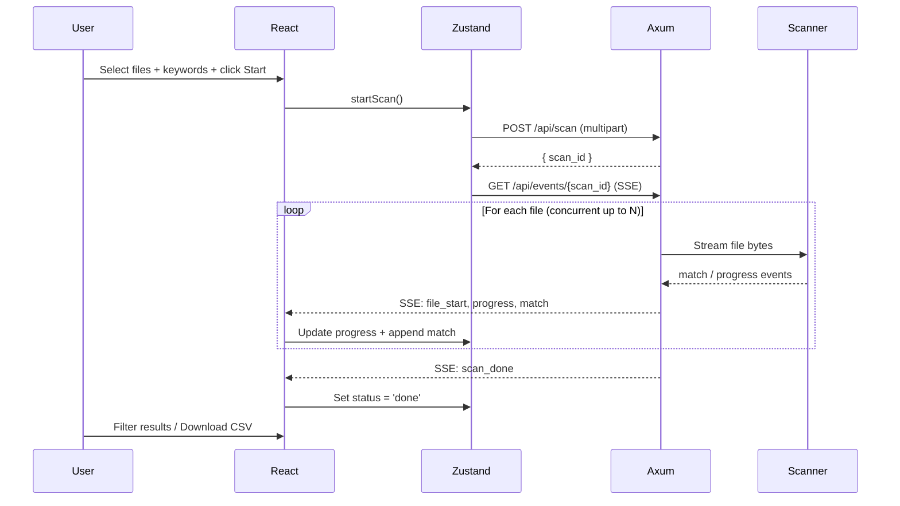

# Technical Specification: LogAnalyzer — Java Log Stream Scanner

## 1. Executive Summary

LogAnalyzer is a **high-performance, single-executable** web-based tool for analyzing Java (Logback/Log4j) log files. Users upload one or more log files through a local web UI; the Rust backend processes them in a **memory-streaming** fashion — no files are ever written to disk. Search results and progress are pushed back to the browser in real-time via **Server-Sent Events (SSE)**.

The final deliverable is a single binary (`loganalyzer`) that embeds the React frontend and serves it on `http://localhost:<port>`. No external runtime, database, or installation is required.

---

## 2. Requirements

### 2.1 Functional Requirements

| ID | Feature | Description |
|----|---------|-------------|
| FR-01 | **Multi-File Upload** | Select and upload multiple `.log` / `.txt` files simultaneously via a file input. |
| FR-02 | **In-Memory Streaming** | Process uploaded bytes as a stream — never buffer the entire file in memory or write to disk. |
| FR-03 | **Keyword Search** | Accept one or more keywords/patterns in a textarea (one per line). Search each file for matches. |
| FR-04 | **Pattern Mode** | Toggle between **Literal** string matching and **Regex** pattern matching. |
| FR-05 | **Case Sensitivity** | Toggle case-sensitive vs. case-insensitive search. |
| FR-06 | **Context Lines** | Configure N lines of context above/below each match (like `grep -C`). |
| FR-07 | **Concurrency** | Control how many files are processed in parallel (1–8 concurrent streams). |
| FR-08 | **Max Matches Per File** | Set a cap on the number of matches returned per file (0 = unlimited). |
| FR-09 | **Per-File Progress** | Display a real-time progress bar per file showing bytes read, lines scanned, and matches found. |
| FR-10 | **Results Table** | Show matches in a scrollable, filterable data table with columns: File, Line#, Matched Keyword, Content, Context. |
| FR-11 | **CSV Export** | Download current results as a `.csv` file. |
| FR-12 | **Scan Controls** | Start, Stop (abort mid-scan), and Reset buttons to manage the scan lifecycle. |
| FR-13 | **Sidebar Navigation** | Navigate between "Search Logs" (main) and "Settings" (placeholder) pages. |

### 2.2 Non-Functional Requirements

| ID | Requirement | Target |
|----|-------------|--------|
| NFR-01 | **Performance** | Stream files up to 2 GB+ without memory exhaustion; target throughput ≥ 200 MB/s on modern hardware. |
| NFR-02 | **Single Binary** | Ship as one executable with embedded static assets. |
| NFR-03 | **Platform** | macOS (primary), Linux, Windows (secondary). |
| NFR-04 | **Startup Time** | Server ready in < 1 second. |
| NFR-05 | **UI Responsiveness** | UI must remain interactive during large-file scans; all heavy work is backend-side. |

---

## 3. Architecture & Tech Stack

### 3.1 System Overview

```
┌─────────────────────────────────────────────────────┐
│                   Single Binary                     │
│  ┌────────────────────┐  ┌────────────────────────┐ │
│  │   Rust Backend     │  │  Embedded React SPA    │ │
│  │   (Axum + Tokio)   │  │  (Vite + React + TS)   │ │
│  │                    │  │                        │ │
│  │  /api/scan  (POST) │◄─│  multipart/form-data   │ │
│  │  /api/events (GET) │──│► SSE stream            │ │
│  │  /            (GET)│──│► Static files           │ │
│  └────────────────────┘  └────────────────────────┘ │
└─────────────────────────────────────────────────────┘
```

### 3.2 Backend — Rust

| Concern | Choice | Rationale |
|---------|--------|-----------|
| Web Framework | **Axum** | Tight Tokio integration, ergonomic extractors, SSE support via `axum::response::sse`. |
| Async Runtime | **Tokio** | Industry standard for async I/O in Rust. Multi-threaded runtime. |
| Pattern Matching | **regex** crate | Fast, safe, well-tested. |
| Static Embedding | **rust-embed** | Compile React build output into the binary at `cargo build` time. |
| Multipart Parsing | **axum::extract::Multipart** | Stream-based multipart body parsing (no temp files). |
| Serialization | **serde + serde_json** | JSON serialization for SSE event payloads. |

### 3.3 Frontend — React

| Concern | Choice | Rationale |
|---------|--------|-----------|
| Build Tool | **Vite** | Fast dev/build, excellent React TS support. |
| Language | **TypeScript** | Type safety for complex state. |
| Styling | **Vanilla CSS** | Full control, no framework dependency. CSS Grid for layout. |
| State Management | **Zustand** | Lightweight, simple store for scan state, results, progress. |
| HTTP Client | **fetch API** | Native `FormData` upload + `EventSource` for SSE. |
| Table Virtualization | **@tanstack/react-virtual** | Render 100K+ rows without DOM bloat. |

---

## 4. API Design

### 4.1 `POST /api/scan` — Start a Scan

**Request**: `multipart/form-data`

| Field | Type | Description |
|-------|------|-------------|
| `files` | File[] | One or more log files (multi-part fields with same name). |
| `keywords` | string | Newline-separated list of search keywords/patterns. |
| `pattern_mode` | `"literal"` \| `"regex"` | Search mode. |
| `case_sensitive` | `"true"` \| `"false"` | Case sensitivity flag. |
| `context_lines` | number | Lines of context around each match. |
| `concurrency` | number | Max parallel file processing (1–8). |
| `max_matches_per_file` | number | 0 = unlimited. |

**Response**: `200 OK` with JSON body:
```json
{
  "scan_id": "uuid-v4",
  "status": "started",
  "file_count": 3
}
```

### 4.2 `GET /api/events/{scan_id}` — SSE Event Stream

**Response**: `text/event-stream`

Event types:

| Event | Payload | Description |
|-------|---------|-------------|
| `file_start` | `{ "file_name": "app.log", "file_index": 0, "total_bytes": 1048576 }` | A file has begun processing. |
| `progress` | `{ "file_index": 0, "bytes_read": 524288, "lines_scanned": 12000, "matches_found": 5 }` | Periodic progress update (~every 100ms or 64KB). |
| `match` | `{ "file_index": 0, "file_name": "app.log", "line_number": 1234, "keyword": "ERROR", "content": "...", "context_before": ["..."], "context_after": ["..."] }` | A match was found. |
| `file_done` | `{ "file_index": 0, "total_lines": 50000, "total_matches": 42 }` | A file finished processing. |
| `scan_done` | `{ "total_files": 3, "total_matches": 128 }` | All files complete. |
| `error` | `{ "message": "Invalid regex pattern" }` | An error occurred. |

### 4.3 `POST /api/scan/{scan_id}/stop` — Abort Scan

**Response**: `200 OK` — stops all in-progress file streams for this scan.

---

## 5. UI Layout & Component Hierarchy

```
App
├── Sidebar
│   ├── Logo / Title ("LogAnalyzer")
│   ├── NavItem: "Search Logs" (active)
│   └── NavItem: "Settings"
├── SearchLogsPage
│   ├── Header
│   │   ├── PageTitle ("Search Logs")
│   │   └── ActionButtons (Start / Stop / Reset)
│   ├── FileAttachArea
│   │   ├── FileInput (multi-file, drag-and-drop)
│   │   ├── ConcurrencySlider (1–8)
│   │   ├── MaxMatchesInput
│   │   ├── CaseSensitivityToggle
│   │   └── PatternModeSelect (Literal / Regex)
│   ├── KeywordsArea
│   │   ├── KeywordsTextarea
│   │   └── ContextLinesInput
│   ├── ProgressArea
│   │   └── FileProgressBar[] (per file: name, bar, bytes/lines/matches)
│   └── ResultArea
│       ├── FilterBar (search within results)
│       ├── ResultTable (virtualized)
│       └── CSVDownloadButton
└── SettingsPage
    └── Placeholder ("Not Implemented")
```

### 5.1 Wireframe Reference

```
+---------------------------------------------------------------+
| Sidebar (200px)    | Main Content Area                        |
|--------------------+------------------------------------------+
| Logo/Title         | [Search Logs]        [Start][Stop][Reset] |
| ● Search Logs      |------------------------------------------|
|   Settings          | 📎 File Attach Area                      |
|                    | [Choose Files...] [Drag & Drop Zone]     |
|                    | Concurrency: [===3===]                   |
|                    | Max matches: [__100__] Case: [✓] Regex:[○]|
|                    |------------------------------------------|
|                    | 🔍 Keywords                               |
|                    | [                                    ]   |
|                    | [  textarea for keywords             ]   |
|                    | Context lines: [__3__]                   |
|                    |------------------------------------------|
|                    | 📊 Progress                               |
|                    | app.log    [████████░░] 80%  45K lines   |
|                    | server.log [████░░░░░░] 40%  12K lines   |
|                    |------------------------------------------|
|                    | 📋 Results (142 matches)    [⬇ CSV]      |
|                    | [Filter: ________]                       |
|                    | File    | Line | Keyword | Content       |
|                    | app.log | 1234 | ERROR   | NullPointer  |
|                    | app.log | 5678 | WARN    | Timeout...    |
+---------------------------------------------------------------+
```

---

## 6. State Management & Data Flow

### 6.1 Zustand Store Shape

```typescript
interface ScanStore {
  // Configuration
  files: File[];
  keywords: string;
  patternMode: 'literal' | 'regex';
  caseSensitive: boolean;
  contextLines: number;
  concurrency: number;
  maxMatchesPerFile: number;

  // Scan lifecycle
  scanId: string | null;
  scanStatus: 'idle' | 'running' | 'stopped' | 'done' | 'error';

  // Progress (indexed by file_index)
  fileProgress: Map<number, {
    fileName: string;
    totalBytes: number;
    bytesRead: number;
    linesScanned: number;
    matchesFound: number;
    status: 'pending' | 'scanning' | 'done';
  }>;

  // Results
  matches: MatchEntry[];
  filter: string;

  // Actions
  startScan: () => Promise<void>;
  stopScan: () => Promise<void>;
  resetScan: () => void;
}
```

### 6.2 Data Flow Sequence



---

## 7. Backend Processing Pipeline

```
Incoming multipart bytes
    │
    ▼
┌──────────────────────┐
│  Chunk Receiver       │  Receive ~64KB chunks from multipart stream
│  (Axum Multipart)     │
└──────────┬───────────┘
           │
           ▼
┌──────────────────────┐
│  Line Buffer          │  Buffer partial lines at chunk boundaries
│  (Vec<u8> carry-over) │  Split by newline, carry incomplete last line
└──────────┬───────────┘
           │
           ▼
┌──────────────────────┐
│  Pattern Matcher      │  Apply regex/literal search per complete line
│  (regex crate)        │  Track line numbers, collect context window
└──────────┬───────────┘
           │
           ▼
┌──────────────────────┐
│  SSE Emitter          │  Serialize match/progress as SSE events
│  (tokio::sync::mpsc)  │  Send to EventSource channel
└──────────────────────┘
```

Key design decisions:
- **No disk I/O**: Uploaded bytes flow from the HTTP body stream directly into the line buffer.
- **Context window**: Maintain a rolling ring buffer of N lines for "before" context; collect N lines after a match for "after" context.
- **Concurrency**: Use `tokio::spawn` with a semaphore (bounded to `concurrency` value) to process files in parallel.
- **Cancellation**: Use a `CancellationToken` per scan session so Stop can abort all in-flight tasks.

---

## 8. Build & Distribution

```bash
# 1. Build frontend
cd frontend && npm run build
# Output: frontend/dist/

# 2. Build backend (embeds frontend/dist/ via rust-embed)
cd backend && cargo build --release
# Output: target/release/loganalyzer

# 3. Run
./loganalyzer
# → Serving on http://localhost:3000
```

---

## 9. Directory Structure

```
app_build/
├── backend/
│   ├── Cargo.toml
│   ├── src/
│   │   ├── main.rs          # Server bootstrap, route registration
│   │   ├── routes/
│   │   │   ├── mod.rs
│   │   │   ├── scan.rs      # POST /api/scan, POST /api/scan/:id/stop
│   │   │   └── events.rs    # GET /api/events/:scan_id (SSE)
│   │   ├── scanner/
│   │   │   ├── mod.rs
│   │   │   ├── engine.rs    # Chunk processing, line splitting, pattern matching
│   │   │   └── session.rs   # ScanSession state management
│   │   ├── models.rs        # Data types (ScanConfig, MatchEntry, ProgressEvent)
│   │   └── static_files.rs  # rust-embed setup for serving React build
│   └── build.rs             # (optional) build script
├── frontend/
│   ├── package.json
│   ├── vite.config.ts
│   ├── tsconfig.json
│   ├── index.html
│   ├── src/
│   │   ├── main.tsx
│   │   ├── App.tsx
│   │   ├── App.css
│   │   ├── store/
│   │   │   └── scanStore.ts  # Zustand store
│   │   ├── components/
│   │   │   ├── Sidebar.tsx
│   │   │   ├── Header.tsx
│   │   │   ├── FileAttachArea.tsx
│   │   │   ├── KeywordsArea.tsx
│   │   │   ├── ProgressArea.tsx
│   │   │   ├── ResultArea.tsx
│   │   │   └── SettingsPage.tsx
│   │   └── types/
│   │       └── index.ts      # Shared TypeScript types
│   └── public/
└── README.md
```

---

*Generated by the Product Manager (@pm).*
